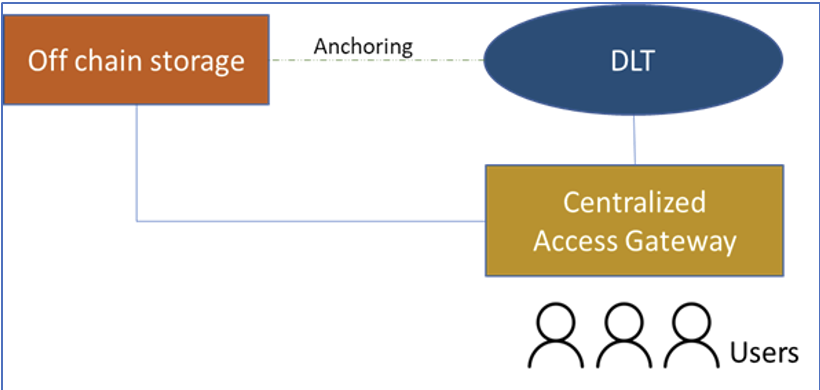
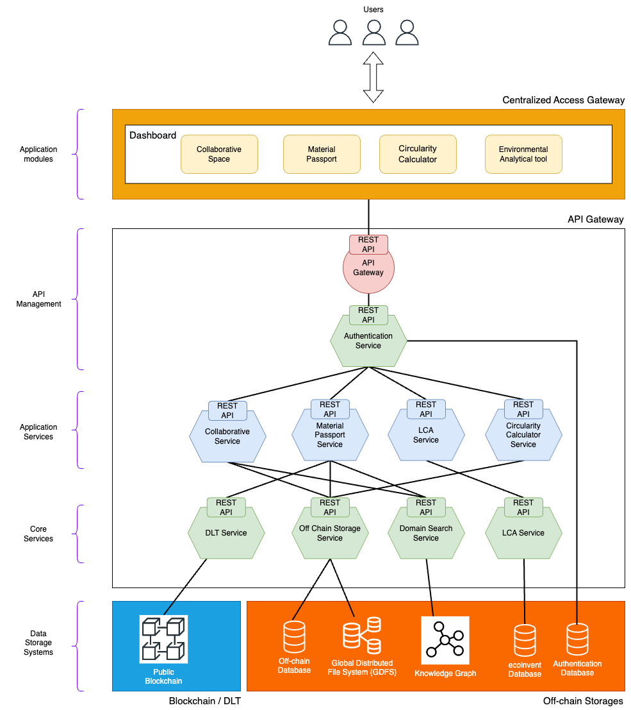

# JIDEP Architecture Overview

## Table of Contents
- [Introduction](#introduction)
- [Architecture Overview](#architecture-overview)
  - [Key Components](#key-components)
  - [Core Services](#core-services)
- [Technology Stack](#technology-stack)
- [How to Get Started](#how-to-get-started)
- [Contributing](#contributing)

## Introduction
This document describes the selection of state-of-the-art technologies for the JIDEP architecture and outlines its structure, including a plan for developing the integrated proof-of-concept. It represents the core services of JIDEP, such as the DLT platform, application gateway, off-chain storage, collaborative space, dashboard, and authentication/authorisation mechanisms. This includes an overview of the system's key components: the Centralised Access Gateway, API Gateway, Blockchain, and Storage Systems. The choice to use containerisation technology for the decentralised parts of JIDEP is explained, along with the decision to use Kubernetes to manage the deployment of JIDEP services. </br>
 </br>
The figure shows the high-level hybrid centralised/decentralised architecture of the JIDEP. It comprises a cloud blockchain/distributed ledger technology, a Centralised Access Gateway, and Off-chain storage. For traceability, immutability, thrustless operation and non-repudiation, data will be stored off-chain and cryptographically anchored on the blockchain (the terms blockchain and DLT are used interchangeably in this document). User access to the data (including user-transparent use of blockchain for the above purposes) will be performed via a Centralised Access Gateway (CAG). The CAG will provide the user experience and dashboard for interaction with the JIDEP collaborative space.

## Architecture Overview
The overall preliminary JIDEP platform architecture is show in below figure:
 </br>

### Key Components
1. **Centralised Access Gateway (CAG)** 
    - The CAG enables the JIDEP users to access all application modules, such as Collaborative Space, Material Passport, Circularity Calculator, and Environmental Analytical tool, through an admin dashboard. The CAG allows users to use the same credentials from any location to access all application modules. This is the component where all the user interfaces will be implemented for application modules.

2. **API Gateway**
     - The API Gateway acts as an intermediary, managing all API requests, authentication, and interactions between the CAG and the backend services.

    - **Blockchain / DLT**
        - JIDEP's DLT component anchors off-chain data to the blockchain, ensuring traceability, immutability, and non-repudiation of data.

    - **Off-chain Storage**
        - Data is stored off-chain in either centralised or decentralised systems based on its encryption status. Non-encrypted data resides in a centralised database, while encrypted data is stored in decentralised systems like the Global Distributed File System (GDFS).

    #### Core Services
     - **DLT Service**: Anchors off-chain data securely onto the blockchain.
     - **Off-chain Storage Service**: Manages both encrypted and non-encrypted off-chain data.
     - **Domain Search Service**: Provides domain-specific metadata search services using a knowledge graph.
     - **Environmental Analytical Service**: Integrates with Life Cycle Analysis (LCA) tools to assess environmental impacts.
     - **Circularity calculator Service**: Circularity calculator application module will use the Circularity calculator service.
   
3. **Data Storage Systems**
     - The JIDEP platform will use centralised and decentralised storage systems implemented as separate services.
    
    #### Core Services
    - **Blockchain**
        - Blockchain will provide a decentralised storage service for cryptographically anchoring off-chain data, which the analysed DLT service will use.
    - **Off-chain Database**
        - Off-chain Database is centralised storage for non-encrypted off-chain data, which will be used by the Off-chain Storage Service
    - **Global Distributed File System**
      - Global Distributed File System is a decentralised storage system for storing encrypted off-chain data, which the Off-chain Storage Service will use.
    - **Knowledge Graph**
        - Knowledge Graph is centralised storage for the graph-structured data model, which the Domain Search Service will use.

## Technology Stack
JIDEP uses modern technologies to manage both centralised and decentralised components:
- **Containerisation**: All decentralised components are containerised.
- **Kubernetes**: The platform uses Kubernetes for orchestration, ensuring scalability and efficient management of services.

## How to Get Started
1. Clone the repository:
   ```bash
   git clone git@github.com:tvsltd/jidep-architecture.git
